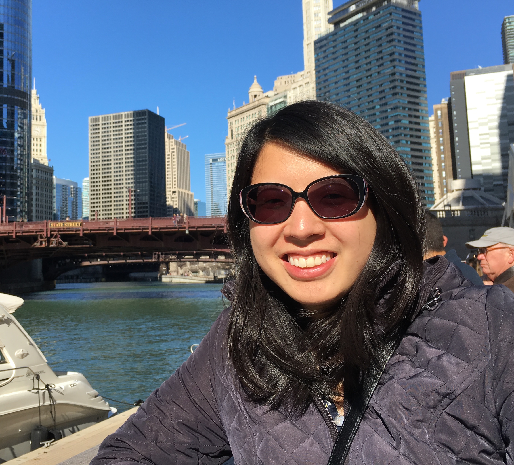

---
---

<link rel="stylesheet" href="styles.css" type="text/css">



## About Me  
  \  
I am a PhD Candidate in [Communication Sciences & Disorders](https://communication.northwestern.edu/departments/csd/about.php) at [Northwestern University](https://www.northwestern.edu/). I work in the [Hearing & Language Lab](http://hll.northwestern.edu/) with Dr. Tina Grieco-Calub. My research investigates how prior experience with sound and language impacts real-time language processing in children and individuals with hearing loss. I get excited about linguistics, cognitive science, phonetics, speech perception, education, and a lot of other things too. 
  
  
On campus, I am president of [Graduate Women Across Northwestern](sites.northwestern.edu/gwan). In and out of the lab, I an R enthusiast and co-organizer/webmaster for [R-Ladies Chicago](https://rladieschicago.org/).  
  
  
How to pronounce my name: **[&#712;k&#230;&#952;&#633;&#618;n &#712;s&#618;mi&#601;n]**
  
  \  
  
  
***  
  
## Affiliations  

```{r, echo = FALSE, out.width="20%"}
library(knitr)
myimages<-list.files("images/affiliations", pattern = ".png", full.names = TRUE)
include_graphics(myimages)
```

*** 
## Education  

#### [Northwestern University](https://www.northwestern.edu/) 
#### Ph.D. (Expected 2020), Communication Sciences & Disorders
  \  

#### [Johns Hopkins University](https://www.jhu.edu/) 
#### B.A. 2013, Cognitive Science  


 
