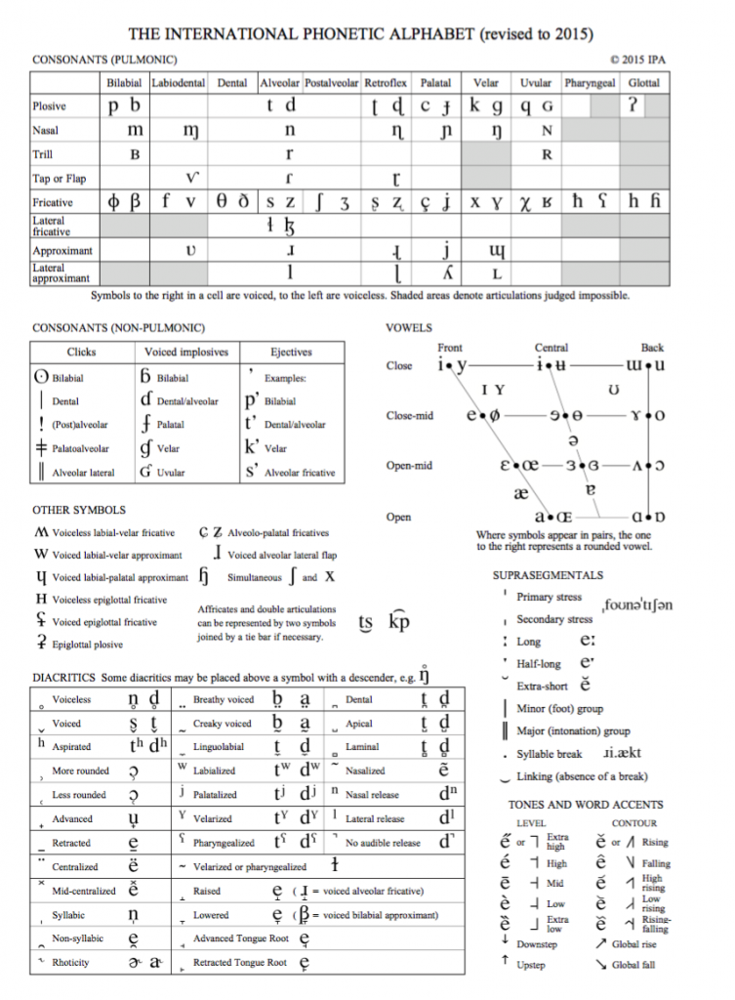

***  
  
### At Northwestern 
  
**Workshop Leader**, Graduate & Postdoctoral Workshop Programs  
[Searle Center for the Advancement of Teaching & Learning](https://www.northwestern.edu/searle/index.html)      
  
I've led interactive workshops on the following topics:  
  
* Communication Strategies for the Multilingual Classroom (Winter 2018)  
* Audienced-Centered TAing in Communication Sciences & Disorders (Summer 2017)  
* Facilitating Learning with Small Group Work (Summer 2017)  
* Promoting Active Learning in STEM: Strategies for Labs & Lectures (Winter 2017)  
  
    
**Lab Instructor**, Department of Communication Sciences & Disorders  
  
* CSD 305: Phonetics (Winter 2016, 2018)  
* CSD 457: Language Science (Fall 2017)  
  
    
**Teaching Assistant**, Department of Communication Sciences & Disorders  
  
* CSD 369: Special Education (Spring 2018)  
* CSD 108: Sound Communication & Health (Spring 2018)  
* CSD 419: Pediatric Audiology (Winter 2018)  
* CSD 473: Clinical Methods - Pediatric Populations (Spring 2016)  
* CSD 392: Language Development & Usage (Fall 2015)  
  
  
As a teaching assistant, I've given guest lectures on the following topics:  
  
* Hearing Impairment & Special Education (for CSD 369)  
* Speech Perception (for CSD 305, 392)  
* Spoken Word Production (for CSD 457)  
* Phonological Development (for CSD 392)  
  
  \  

### Other Teaching	
  
**Instructor**, Advancement Via Individual Determination (AVID) Senior College Experience Program, [Evanston Township High School](https://www.eths.k12.il.us/eths)  
  

  
During the Winter 2018 quarter, I designed and implemented a course titled: ***Say What?* An Introduction to Speech Science**. The course aimed to introduce high school seniors to basic concepts in acoustics and speech science. I'm in the process of creating a github repo with the demos used for this course (stay tuned!), but you can see the course description and objectives below:  
  
**Course Description:**  
Speaking is a complex procedure that involves the coordination of more than a hundred muscles
located in the throat and mouth. However, we are able to speak and listen to others
instantaneously with relative ease. This course will introduce students to the factors that shape speech perception and production. By analyzing and transcribing speech samples from
themselves, TV shows, and other sources, students will quantify sound structure of everyday
speech. After this course, students will be familiarized with components of speech and the
International Phonetic Alphabet, and will use this awareness to be stronger verbal communicators.  
  
  
**Course Objectives:**  
Upon completion of this class, participants will be able to:  

1. Identify components of speech perception and production.  
2. Connect specific speech sounds in English to particular anatomical and respiratory
movements.  
3. Apply speech science concepts to everyday communication.  

***  
  
### Resources for Phonetics & Speech Science  
  
I love thinking of new ways to teach phonetics and develop proficiency in the International Phonetic Alphabet. Here are some external resources I share with my students:  
  
* [IPA Chart & Keyboard](http://westonruter.github.io/ipa-chart/keyboard/)  
* [IPA Chart with Sounds](http://www.internationalphoneticalphabet.org/ipa-sounds/ipa-chart-with-sounds/)  
* [IPA Arcade Games](http://www.academic.muohio.edu/the233/ipaarcade/description.htm)  
* [IPA Version of the addicting "2048" game](http://ibleaman.github.io/geminator/)  
* [Pink Trombone - A fun way to play with articulators](https://dood.al/pinktrombone/)  
  
  
